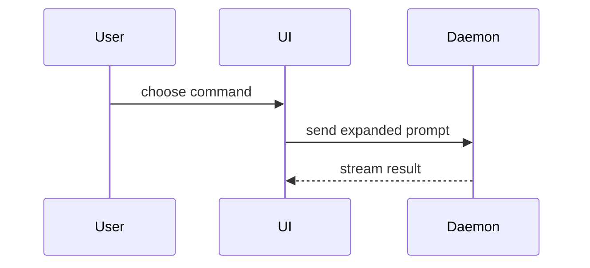

Help the user understand the current topic of conversation visually. Skip the preamble and keep prose brief. Pick the smallest view that makes the key point clear.

- Show logic or an algorithm as pseudocode:

```text
on(save)
  if content is unchanged
    return cached result
  write new content
  return fresh result
```

- Show runtime control flow as a call tree:

```text
submitForm
  createSession
    persistPrompt
    launchAgent
  navigateToSession
```

- Show UI structure as a component tree, including state and module boundaries that matter:

```tsx
<SessionPage> (apps/example/src/routes/session.tsx)
  useSessionEvents()
  <SessionToolbar>
    <RunSkillButton> (packages/ui)
```

- Show file responsibility or a broad refactor as a shallow file tree:

```text
src/
├── commands/       # parses user actions
├── sessions/       # owns session state
└── transport/      # sends API requests
```

- Show component interaction, control flow, or data flow with Mermaid:



- Use `diff` when the point is what changes and the surrounding shape already exists. Match the diff shape to the topic.

For a component change:

```diff
 <SessionPage>
   useSessionEvents()
   <SessionToolbar>
+    <RunSkillButton />
   <SessionTimeline>
+    <SkillResultCard />
```

For a file-layout change:

```diff
 src/
 ├── commands/
+│   └── show-me.ts       # expands the slash command
 ├── sessions/
-└── transport.ts
+└── transport/
+    ├── client.ts
+    └── stream.ts
```

For a call-tree or call-stack change:

```diff
 submitForm
   createSession
     persistPrompt
+    expandSkillMention
     launchAgent
-  navigateToSession
+  navigateToSession
+    subscribeToEvents
```

For a state or control-flow change:

```diff
 on(save)
-  write content
+  if content is unchanged
+    return cached result
+  write new content
+  invalidate cache
```

- Show the whole block when most of it is new, when omitted context would hide ownership or order, or when the user needs a copyable target shape:

```ts
function expandSkill(command: string): string {
  const skillName = command.slice(1)
  return `use the ${skillName} skill`
}
```

- For a visual UI, layout, state comparison, or concept too dense for Mermaid, write one focused HTML file — a diagram, an infographic, or a short slide deck, whichever fits the point. Match the product's colors, type, spacing, and components; use real labels and data; support desktop and mobile. Then open it for the user:

```
Bash(open path/to/show-me-{description}.html)
```

### HTML quality baseline

This applies only when HTML is the smallest useful explanation. Do not turn a tree, diff, code block, or Mermaid diagram into a page just to use the template.

Before writing HTML, read `templates/page.html` relative to this skill directory and copy it as the starting document. Inline its styles in the output so the artifact remains standalone. The empty `main` is intentional: the template supplies visual foundations, not a content outline.

- Choose the format, composition, density, and length to fit the question. No mandatory hero, summary, cards, columns, navigation, or footer. Never invent content to fill a layout.
- Keep the baseline typography, spacing scale, semantic color roles, and accessibility protections. Use the optional composition classes only where useful; do not wrap everything in panels.
- Add topic-specific CSS for diagrams, comparisons, or slides as needed, reusing the tokens. Layout is not locked. When depicting an existing product, its design system takes precedence: adapt the tokens and relevant styles while preserving readability and accessibility. Do not restyle the page merely to make it novel.
- Use size, weight, alignment, and proximity to communicate hierarchy. Keep supporting prose comfortably readable (normally 16px or larger); do not shrink diagram labels to fit. Avoid decorative gradients, shadows, and motion that do not explain anything.
- Use color consistently for meaning, never as the only distinction. Text needs at least 4.5:1 contrast (3:1 for large text); meaningful graphical boundaries and controls need 3:1. Label states, groups, and relationships explicitly.
- Keep code whitespace intact. Wide code, tables, or diagrams may scroll locally; the page itself must not overflow horizontally. Reflow layouts on narrow screens rather than clipping content or scaling everything down.
- Use semantic headings when needed, table headers for data, and accessible names/text equivalents for meaningful graphics. Keep DOM reading order coherent. Scroll regions that need keyboard access must be focusable and named. Controls must work with keyboard focus and have descriptive labels; omit nonfunctional controls.
- Set the document language and a descriptive title. Use real labels and supplied data; distinguish unknowns or illustrative examples from facts. Escape inserted text rather than interpreting it as HTML.
- Prefer native HTML/CSS and inline SVG; no framework, remote fonts, or external assets are needed for the baseline. Add scripting only for an explanatory interaction. Respect reduced motion and keep essential content available without animation.

Before delivery, check the actual artifact:

- Does the visual answer the question without filler or unnecessary containers?
- Are hierarchy, spacing, alignment, and color meanings consistent?
- At 375px and 1440px widths, and at 200% zoom, are text and diagram labels readable, with no overlap, truncation, or page-level horizontal overflow?
- If present, do long code lines, long Korean/English labels, and wide tables stay usable? Do diagram arrows and labels remain unambiguous?
- If interactive, do keyboard operation and visible focus work? Are there any missing assets or runtime errors?

Use browser inspection when available. If unavailable, inspect the markup/CSS and disclose that visual verification was not performed; do not claim checks passed without running them. Fix observed problems before opening the artifact for the user. These are quality checks, not required content sections.

### guidance

Place each visual next to the short text it supports. Keep only the calls, files, props, states, and boundaries needed to answer the user's current question or the options to resolve the current discussion point.

You may use one of these, you may use several, it is unlikely you will use all of them. Use your judgement and don't overwhelm the user.
